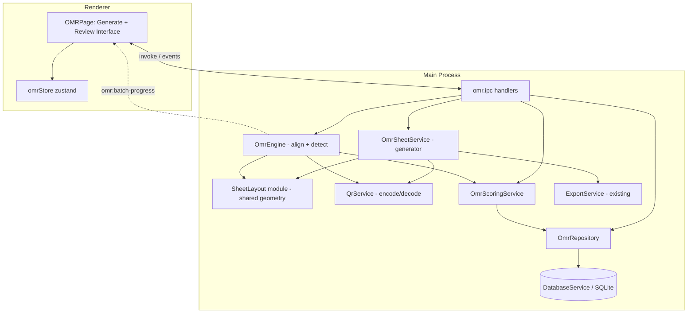

# Design Document

## Overview

This design adds an offline OMR (Optical Mark Recognition) + QR-code auto-marking pipeline to Kairos. It lets a teacher generate a printable answer sheet for an existing exam, print it, collect filled sheets from students, then photograph or scan them and have Kairos read the QR code, deterministically detect filled bubbles, score the sheet against the exam's correct answers, and — after teacher review — write the result into the existing `scores` table with a full audit trail.

The subsystem is scoped to objective questions only (`multiple_choice` and `true_or_false`). All processing runs fully offline using local device resources. Marking is **deterministic** (rule-based image analysis with fixed thresholds), never AI inference, so results are reproducible and verifiable.

### Design goals

- **Reuse existing architecture.** The pipeline follows the established main-process service + typed IPC + Zustand-store/React-page pattern. Scores land in the existing `scores` table using `getGrade()` for grade derivation and the existing `QuestionScore` shape.
- **Deterministic core.** The layout, QR payload, bubble classification, and scoring logic are pure functions with no randomness, no clock reads, and no AI calls. This is what makes the "same image → same result" guarantee (Requirement 7.2) hold and is the primary surface for property-based testing.
- **Shared layout contract.** The `Sheet_Generator` and the `OMR_Engine` derive bubble coordinates from a single shared layout module keyed by exam + layout version. Because both sides compute geometry the same way, a generated sheet is always readable by the engine that shares its version.
- **Graceful degradation.** A bad file, unreadable QR, failed alignment, or low-quality image never blocks a batch; each sheet carries a status and reason and the batch continues.

### Key research findings (library selection)

The project currently has **no image-processing, QR-encode, or QR-decode dependency** (only `tesseract.js` for OCR, `pdf-parse`, and `mammoth`). To keep everything offline and pure-JS (no native OpenCV build step, consistent with the existing pure-JS/`better-sqlite3`-only native footprint), the design proposes three well-established, actively-maintained, pure-JavaScript libraries:

- **`jimp`** — pure-JS image decoding (JPEG/PNG/BMP/TIFF) and pixel access (grayscale, crop, resize, per-pixel reads). No native binaries; works in the Electron main process offline. Used to load a `Sheet_Image` and read pixel intensities.
- **`jsqr`** — pure-JS QR decoder that takes an RGBA `Uint8ClampedArray` plus width/height and returns the decoded string and the QR's corner locations. Used by the `QR_Reader`. The returned corner locations double as alignment anchors.
- **`qrcode`** — pure-JS QR encoder that renders a payload to a data-URL/SVG. Used by the `Sheet_Generator` to embed the QR into the printable HTML.

These are additive dependencies (medium risk: they add to `package.json` and install size but require no native rebuild). Alignment/perspective correction is implemented in-house (a 4-point homography solver + bilinear sampling) rather than pulling in OpenCV, keeping the dependency footprint small and the math deterministic and testable.

Content was rephrased for compliance with licensing restrictions.

## Architecture

The pipeline splits into a **generation path** (exam → printable sheet) and a **reading/marking path** (images → reviewed scores). Both live in the main process; the renderer drives them through typed IPC and renders the review UI.



### Generation path (Requirements 1, 2)

1. Teacher picks an exam (and optionally assigns a student) in the `OMRPage`.
2. `omr:generate-sheet` invokes `OmrSheetService`, which:
   - Filters the exam to `Objective_Question`s; if none, returns a decline result (Req 1.5).
   - Asks `SheetLayout.build(exam, version)` for the deterministic bubble geometry.
   - Asks `QrService.encode(payload)` for the QR data-URL.
   - Builds the answer-sheet HTML (fiducial markers + QR + numbered bubble grid) and hands it to the existing `ExportService` print-to-PDF pipeline (Req 1.7).

### Reading/marking path (Requirements 3–13)

1. Teacher imports one or more image files (`file:open-dialog` with `multiSelections`).
2. `omr:process-images` creates a `Batch`, then processes each `Sheet_Image` sequentially, emitting `omr:batch-progress` after each (Req 3.2, 3.3):
   - **Decode file** with `jimp`; unreadable files → `failed` with reason, continue (Req 3.4).
   - **Read QR** with `QrService.decode`; unreadable QR → `qr_unreadable`, continue (Req 5.1, 5.3).
   - **Resolve identity**: match `examId` against `exams`, `studentId` against `students` (Req 4).
   - **Align**: `OmrEngine` locates fiducial markers + QR corners, computes the homography, and geometrically corrects the image; too few markers → `alignment_failed` (Req 6).
   - **Detect**: sample each bubble region, measure fill intensity, classify each row, assign per-answer and sheet `Confidence_Score`s (Req 7, 8).
   - **Score**: `OmrScoringService` compares detected vs expected for objective questions and computes raw/max/percentage/grade (Req 9, 14).
   - Persist a `sheet` row (status `detected`, or a flag status if it needs attention).
3. Renderer shows results with confidence indicators and flags (Req 10).
4. Teacher reviews/overrides answers and assigns students; each edit triggers `omr:recompute` (Req 11).
5. Teacher finalizes single or batch; `Score_Recorder` writes to `scores` and stores an `Audit_Record` (Req 12, 13).

### Determinism boundary

Everything inside `SheetLayout`, `QrService` (payload build/parse), the classification/scoring functions of `OmrEngine`/`OmrScoringService`, and confidence computation is pure and deterministic. The impure edges are: file I/O (jimp decode), the QR decode call, DB writes, and PDF rendering. This boundary is deliberately drawn so the deterministic core can be property-tested without mocking the world.

## Components and Interfaces

### 1. `SheetLayout` (shared geometry module)

`src/shared/omr-layout.ts` — pure, imported by both generator and engine so they always agree.

```ts
export const OMR_LAYOUT_VERSION = 1

export interface BubbleLayout {
  questionId: string
  optionLabel: string        // 'A'.'E' | 'T' | 'F'
  cx: number                 // center X, sheet-normalized 0..1
  cy: number                 // center Y, sheet-normalized 0..1
  r: number                  // radius, sheet-normalized
}

export interface RowLayout {
  questionId: string
  number: number             // exam question number shown to student (Req 1.6)
  type: 'multiple_choice' | 'true_or_false'
  optionLabels: string[]     // MC option labels; ['T','F'] for true/false (Req 1.3, 1.4)
  bubbles: BubbleLayout[]
}

export interface FiducialMarker { cx: number; cy: number; size: number } // corner registration marks

export interface SheetLayout {
  version: number
  examId: string
  fiducials: FiducialMarker[]         // >= 4 corner markers (Req 6.1)
  qrArea: { x: number; y: number; w: number; h: number }
  rows: RowLayout[]
}

/** Deterministic: same (exam, version) always yields identical geometry. */
export function buildLayout(exam: Exam, version?: number): SheetLayout

/** The objective-only question list, in stable order, used everywhere. */
export function objectiveQuestions(exam: Exam): Question[]
```

`objectiveQuestions` centralizes the Req 14.1 scope rule: keep only `type === 'multiple_choice' || type === 'true_or_false'`, preserving exam order. `buildLayout` produces one `RowLayout` per objective question (Req 1.1, 1.2), one bubble per MC option label from `question.options` (Req 1.3), and exactly two bubbles `['T','F']` for true/false (Req 1.4).

### 2. `QrService`

`src/main/services/QrService.ts` — encode is pure over the payload; decode wraps `jsqr`.

```ts
export interface QrPayload {
  v: number                        // layout version (Req 2.5)
  examId: string                   // (Req 2.2)
  studentId: string                // real id or UNASSIGNED sentinel (Req 2.3, 2.4)
}

export const UNASSIGNED = 'UNASSIGNED'

export class QrService {
  encode(payload: QrPayload): Promise<string>            // -> PNG data URL for HTML embed
  encodeText(payload: QrPayload): string                 // canonical JSON string (pure)
  parse(text: string): QrPayload | null                  // inverse of encodeText (pure)
  decode(img: RgbaImage): { payload: QrPayload | null; corners: Point[] | null }
}
```

`encodeText`/`parse` are exact inverses (round-trip). `decode` runs `jsqr` over the RGBA buffer; on failure it returns `{ payload: null, corners: null }` so the caller marks the sheet `qr_unreadable` (Req 5.1). The QR corner points are surfaced to the engine as extra alignment anchors.

### 3. `OmrSheetService` (generator)

`src/main/services/OmrSheetService.ts`

```ts
export interface GenerateSheetRequest { examId: string; studentId?: string }
export interface GenerateSheetResult {
  ok: boolean
  filePath?: string
  message?: string               // decline reason when ok=false (Req 1.5)
}

export class OmrSheetService {
  generate(req: GenerateSheetRequest): Promise<GenerateSheetResult>
}
```

Flow: load exam → `objectiveQuestions`; if empty, return `{ ok: false, message: 'This exam has no objective questions eligible for OMR.' }` (Req 1.5). Otherwise build layout, build `QrPayload` (`studentId ?? UNASSIGNED`), encode QR, render HTML, and export. HTML rendering is added to `ExportService` (below) to satisfy Req 1.7.

### 4. `ExportService` extension

Add a printable answer-sheet builder that reuses the existing `buildHTML` → hidden-`BrowserWindow` → `printToPDF` machinery.

```ts
// new ExportPayload variant
type ExportType = 'lesson' | 'exam' | 'report' | 'marking_scheme' | 'answer_sheet'

interface AnswerSheetContent {
  layout: SheetLayout
  qrDataUrl: string
  exam: { title: string; subject: string; classLevel: string }
  studentName?: string
}
```

`buildAnswerSheetHTML` positions the four fiducial markers as solid black squares at the sheet corners, places the QR image in `qrArea`, and renders the bubble grid as a table with the **exam question number** in the left gutter of each row (Req 1.6) and labeled empty circles for each option. Coordinates come straight from `SheetLayout` (normalized → CSS `%`/`mm`), so the printed geometry matches what the engine expects.

### 5. `OmrEngine` (alignment + deterministic detection)

`src/main/services/OmrEngine.ts` — the impure decode edge plus a pure detection core.

```ts
export interface RgbaImage { data: Uint8ClampedArray; width: number; height: number }

export interface AlignmentResult {
  ok: boolean
  homography?: number[]          // 3x3 row-major
  markersFound: number
  quality: number                // 0..100, feeds sheet confidence (Req 6.4)
  reason?: string
}

export interface DetectedAnswer {
  questionId: string
  number: number
  optionLabels: string[]
  intensities: Record<string, number>   // per-option fill fraction 0..1
  selected: string[]                     // options over fill threshold
  status: 'ok' | 'blank' | 'multiple' | 'ambiguous'
  confidence: number                     // 0..100 (Req 7.4)
  flagged: boolean                       // needs review (Req 8.2, 8.3, 10.2)
}

export interface SheetDetection {
  answers: DetectedAnswer[]
  sheetConfidence: number                // 0..100 (Req 7.5)
}

export class OmrEngine {
  loadImage(filePath: string): Promise<RgbaImage>                    // jimp; throws on unreadable (Req 3.4)
  align(img: RgbaImage, layout: SheetLayout, qrCorners: Point[] | null): AlignmentResult  // Req 6
  detect(img: RgbaImage, layout: SheetLayout, align: AlignmentResult, cfg: OmrConfig): SheetDetection  // pure over inputs
}
```

**Alignment (Req 6):** locate the dark fiducial squares (connected-component search in the thresholded image near expected corners) plus the QR corners. With ≥4 correspondences, solve a homography mapping sheet-normalized coordinates → image pixels. Fewer than 4 usable markers → `{ ok: false, reason: 'Could not locate enough reference markers' }` → status `alignment_failed` (Req 6.3). Low `quality` (blur/contrast heuristic) below a threshold → sheet flagged with reason (Req 6.4).

**Detection (Req 7, 8):** for each bubble, map its normalized center through the homography, sample a small disk in the grayscale image, and compute the dark-pixel fraction as `intensity`. Then `classifyRow` (pure) applies fixed thresholds from `OmrConfig`:

```ts
export interface OmrConfig {
  fillThreshold: number          // intensity above which a bubble counts as filled (Req 8.1, 8.2)
  ambiguityMargin: number        // min gap between top-1 and top-2 intensity (Req 8.3)
  lowConfidenceThreshold: number // sheet/answer confidence <= this is flagged (Req 10)
}
```

- No bubble over `fillThreshold` → `status='blank'` (Req 8.1).
- More than one over `fillThreshold` → `status='multiple'`, `flagged=true` (Req 8.2).
- `(top1 - top2) < ambiguityMargin` → `flagged=true`, `status='ambiguous'` (Req 8.3).
- Otherwise `status='ok'`, `selected=[topLabel]`.

`classifyRow`, `answerConfidence`, and `sheetConfidence` are pure functions of the intensity vector + config, giving the determinism guarantee (Req 7.2): the same image and config always produce identical answers and scores.

### 6. `OmrScoringService`

`src/main/services/OmrScoringService.ts` — pure scoring, reuses `getGrade`.

```ts
export interface ObjectiveAnswerKey { questionId: string; expected: string; marks: number }

export interface ScoreResult {
  perQuestion: QuestionScore[]   // existing shape { questionId, score, maxScore }
  rawScore: number
  maxScore: number
  percentage: number             // 0..100
  grade: 'A'|'B'|'C'|'D'|'F'
}

export class OmrScoringService {
  buildKey(exam: Exam): ObjectiveAnswerKey[]                                   // objective-only (Req 14)
  effectiveAnswer(d: DetectedAnswer, override?: string[]): string | null       // override wins (Req 8.5, 11.2)
  score(key: ObjectiveAnswerKey[], answers: DetectedAnswer[], overrides: Record<string,string[]>): ScoreResult
}
```

Scoring rules: for each objective question, the effective answer is the teacher override if present, else the detected `selected`. A single option exactly equal to `expected` earns `marks`; blank, multiple (un-overridden), or mismatched earns 0 (Req 8.4, 8.5, 9.2, 9.3). `rawScore` = sum awarded; `maxScore` = sum of objective `marks` (Req 9.4, 9.5, 14.2); `percentage = round(raw/max*100)`; `grade = getGrade(percentage)` (Req 9.6). Because `score` is pure, the review UI recomputes by calling it again with new overrides (Req 11.2).

### 7. `OmrRepository` + migration

`src/main/services/OmrRepository.ts` wraps `DatabaseService`. A new migration `005_omr` adds three tables. It also adds the missing lookup needed for score replacement (Req 12.4/12.5), since `scores` has no unique `(student_id, exam_id)` constraint today.

```ts
export class OmrRepository {
  createBatch(teacherId: string, examId?: string): OmrBatch
  saveSheet(sheet: OmrSheet): OmrSheet
  getSheet(id: string): OmrSheet | null
  getBatchSheets(batchId: string): OmrSheet[]
  updateSheet(id: string, patch: Partial<OmrSheet>): void
  saveAudit(a: OmrAuditRecord): OmrAuditRecord
  getAuditByScore(scoreId: string): OmrAuditRecord | null
}
```

`DatabaseService` gains: `getScoreByStudentExam(studentId, examId): Score | null` and `replaceScore(existingId, score)` to support the "confirm before replacing" flow (the existing `saveScore` always inserts a fresh UUID and cannot overwrite by student+exam).

### 8. IPC layer

`src/main/ipc/omr.ipc.ts`, registered in `app.ts` as `registerOMRHandlers(ipcMain, db, ...)`, following the existing handler style. New typed channels are added to `KairosInvokeChannels` and one event to `KairosEventChannels`.

```ts
// invoke channels
'omr:generate-sheet': (req: GenerateSheetRequest) => GenerateSheetResult
'omr:process-images': (req: { examHint?: string; filePaths: string[] }) => { batchId: string }
'omr:get-batch':      (batchId: string) => OmrSheet[]
'omr:assign':         (req: { sheetId: string; examId?: string; studentId?: string }) => OmrSheet
'omr:recompute':      (req: { sheetId: string; overrides: Record<string,string[]> }) => OmrSheet
'omr:finalize':       (req: { sheetId: string; confirmReplace?: boolean }) => FinalizeResult
'omr:finalize-batch': (req: { sheetIds: string[]; confirmReplace?: boolean }) => FinalizeResult[]
'omr:get-audit':      (scoreId: string) => OmrAuditRecord | null

// event (main -> renderer), mirrors ai:batch-progress
'omr:batch-progress': { batchId: string; done: number; total: number; current: string }
```

`FinalizeResult` reports success, or `{ needsStudent: true }` (Req 11.4) / `{ needsConfirmReplace: true, existingScoreId }` (Req 12.4). `process-images` runs the batch asynchronously and emits `omr:batch-progress` per sheet, exactly like `ai:batch-reports` emits `ai:batch-progress` today.

### 9. Renderer: `OMRPage` + `omrStore`

`src/renderer/src/pages/OMRPage.tsx` and a `useOmrStore` slice in `stores/index.ts`, using the existing `ipc()` helper, `onEvent` for progress, and `Primitives`/`Toast` components. Two modes:

- **Generate**: exam picker, optional student assignment, "Generate Answer Sheet" → `omr:generate-sheet` → open the PDF. Shows the decline message when the exam has no objective questions.
- **Review Interface** (Req 10, 11): sheet list with per-sheet `Confidence_Score` and visual flags for low-confidence / attention statuses; a detail view listing each `Detected_Answer` beside its `Expected_Answer`, editable option overrides, a student assignment control, and Finalize (single) / Finalize All (batch) actions. Overrides call `omr:recompute`; finalize calls `omr:finalize`. An audit viewer fetches `omr:get-audit` for a finalized sheet (Req 13.5).

The Review Interface visually distinguishes flagged sheets/answers (e.g. amber/red `Badge` + border) from clean ones, reusing the color conventions already in `MarkingPage`/`utils`.

## Data Models

### Domain types (`src/shared/omr-types.ts`)

```ts
export type SheetStatus =
  | 'failed'            // unreadable file (Req 3.4)
  | 'qr_unreadable'     // QR not decodable (Req 5.1)
  | 'exam_not_found'    // QR examId has no match (Req 4.3)
  | 'needs_student'     // unassigned / unknown student (Req 4.5, 4.6)
  | 'alignment_failed'  // too few markers (Req 6.3)
  | 'low_quality'       // detection unreliable (Req 6.4)
  | 'detected'          // scored, ready for review
  | 'finalized'         // written to scores (Req 12)

export interface OmrBatch {
  id: string
  teacherId: string
  examId?: string
  total: number
  processed: number
  createdAt: number
}

export interface AnswerOverride { questionId: string; original: string[]; overridden: string[] }

export interface OmrSheet {
  id: string
  batchId: string
  examId?: string
  studentId?: string
  status: SheetStatus
  reason?: string
  qrPayload?: QrPayload
  sheetConfidence: number
  detectedAnswers: DetectedAnswer[]
  overrides: Record<string, string[]>   // questionId -> option labels
  rawScore: number
  maxScore: number
  percentage: number
  grade: 'A'|'B'|'C'|'D'|'F'
  imagePath: string
  createdAt: number
  finalizedAt?: number
}

export interface OmrAuditRecord {
  id: string
  scoreId: string
  sheetId: string
  examId: string
  studentId: string
  detectedAnswers: DetectedAnswer[]      // includes per-answer confidence (Req 13.2)
  sheetConfidence: number                // (Req 13.2)
  overrides: AnswerOverride[]            // original vs overridden (Req 13.3)
  imagePath: string                      // source image reference (Req 13.4)
  createdAt: number
}
```

### Persistence (`005_omr` migration)

```sql
CREATE TABLE IF NOT EXISTS omr_batches (
  id          TEXT PRIMARY KEY,
  teacher_id  TEXT NOT NULL,
  exam_id     TEXT,
  total       INTEGER NOT NULL DEFAULT 0,
  processed   INTEGER NOT NULL DEFAULT 0,
  created_at  INTEGER NOT NULL
);

CREATE TABLE IF NOT EXISTS omr_sheets (
  id               TEXT PRIMARY KEY,
  batch_id         TEXT NOT NULL REFERENCES omr_batches(id) ON DELETE CASCADE,
  exam_id          TEXT,
  student_id       TEXT,
  status           TEXT NOT NULL,
  reason           TEXT,
  qr_payload       TEXT,                 -- JSON
  sheet_confidence REAL NOT NULL DEFAULT 0,
  detected_answers TEXT NOT NULL DEFAULT '[]',   -- JSON
  overrides        TEXT NOT NULL DEFAULT '{}',    -- JSON
  raw_score        REAL NOT NULL DEFAULT 0,
  max_score        REAL NOT NULL DEFAULT 0,
  percentage       REAL NOT NULL DEFAULT 0,
  grade            TEXT,
  image_path       TEXT NOT NULL,
  created_at       INTEGER NOT NULL,
  finalized_at     INTEGER
);

CREATE TABLE IF NOT EXISTS omr_audit (
  id               TEXT PRIMARY KEY,
  score_id         TEXT NOT NULL,
  sheet_id         TEXT NOT NULL,
  exam_id          TEXT NOT NULL,
  student_id       TEXT NOT NULL,
  detected_answers TEXT NOT NULL DEFAULT '[]',
  sheet_confidence REAL NOT NULL DEFAULT 0,
  overrides        TEXT NOT NULL DEFAULT '[]',
  image_path       TEXT NOT NULL,
  created_at       INTEGER NOT NULL
);

CREATE INDEX IF NOT EXISTS idx_omr_sheets_batch ON omr_sheets(batch_id);
CREATE INDEX IF NOT EXISTS idx_omr_audit_score  ON omr_audit(score_id);
```

The migration is appended to the existing `migrations` array in `DatabaseService.runMigrations()`, following the established idempotent pattern.

### Score write mapping (Req 12, 14)

On finalize, `Score_Recorder` maps an `OmrSheet` to the existing `Score` shape:

| Score field | Source |
|---|---|
| `studentId`, `examId`, `teacherId` | resolved sheet identity |
| `rawScore`, `maxScore`, `percentage`, `grade` | `OmrScoringService.score(...)` |
| `questionScores` | per objective question `{ questionId, score, maxScore }` (Req 12.2) |
| `markedAt` | finalization time (Req 12.3) |
| `teacherComment` | tagged marker indicating objective-only OMR result (Req 14.3) |

Sample images are copied into a dedicated `omr/` folder under `userData` (mirroring the existing `uploads/` handling in `file.ipc.ts`), and `image_path` stores the copied path so the audit reference survives the original file being moved (Req 13.4).

### Source image ingestion

Reuses the existing `file:open-dialog` (with `multiSelections: true`) to pick files, then passes paths to `omr:process-images`. Accepted extensions match the image types `DocumentService` already handles (`.png/.jpg/.jpeg/.bmp/.tiff/.tif`). No network access is used anywhere in the path (Req 3.1, 3.5).

## Correctness Properties

*A property is a characteristic or behavior that should hold true across all valid executions of a system — essentially, a formal statement about what the system should do. Properties serve as the bridge between human-readable specifications and machine-verifiable correctness guarantees.*

The OMR core is built from pure, deterministic functions (layout, QR payload codec, homography solver, row classification, confidence, scoring, mapping, and audit builders). These are the ideal surface for property-based testing. The properties below were derived from the prework analysis; UI rendering, PDF export, QR image decoding, marker detection on rasterized images, progress emission, and database side effects are covered by example/integration/smoke tests in the Testing Strategy instead.

### Property 1: Layout reflects the exam's objective questions

*For any* exam, `buildLayout` produces exactly one row per objective question (in exam order), produces no row for any non-objective question, gives each multiple_choice row one bubble per option label matching that question's options, gives each true_or_false row exactly two bubbles labelled `T` and `F`, and sets each row's displayed number to the corresponding exam question number.

**Validates: Requirements 1.1, 1.2, 1.3, 1.4, 1.6**

### Property 2: Exams without objective questions are declined

*For any* exam whose questions are all non-objective (or which has no questions), sheet generation returns a decline result (`ok === false`) with a non-empty message indicating there are no objective questions eligible for OMR.

**Validates: Requirements 1.5**

### Property 3: QR payload round-trip preserves identity and version

*For any* QR payload (exam id, student id — whether a real id or the unassigned sentinel — and version), parsing the encoded text reproduces an equal payload, so the exam id, student id (including the unassigned marker), and layout version are always recoverable from a generated sheet.

**Validates: Requirements 2.2, 2.3, 2.4, 2.5**

### Property 4: Batch processing is total and resilient

*For any* batch of submitted files, the pipeline yields exactly one result per input in the same order and always completes: a file that cannot be decoded is recorded with status `failed` and a non-empty reason, a file whose QR cannot be decoded is recorded with status `qr_unreadable` and its image path retained, and neither prevents the remaining files from being processed.

**Validates: Requirements 3.2, 3.4, 5.1, 5.3**

### Property 5: Identity resolution from the QR payload

*For any* decoded payload combined with the existence of the referenced exam and student, resolution assigns the correct status: matched exam id associates the exam; an exam id with no match yields `exam_not_found`; a student id that matches an existing student associates that student; the unassigned sentinel, or a student id with no match, yields `needs_student`.

**Validates: Requirements 4.2, 4.3, 4.4, 4.5, 4.6**

### Property 6: Alignment recovers geometry or fails cleanly

*For any* set of four or more non-degenerate point correspondences produced by an arbitrary rotation/skew/perspective transform, the solved homography maps the transformed points back to their originals within a small tolerance; and *for any* input offering fewer than four usable correspondences, alignment returns a failure result (`ok === false`) with a reason rather than a homography.

**Validates: Requirements 6.2, 6.3**

### Property 7: Detection is deterministic and covers every row

*For any* aligned sheet input and configuration, detection produces exactly one Detected_Answer per layout row, and running detection again on the identical input produces deeply-equal answers and sheet result (no randomness, no external state).

**Validates: Requirements 7.1, 7.2**

### Property 8: Confidence scores stay within range

*For any* detection result, every per-answer Confidence_Score and the sheet Confidence_Score lie within the inclusive range 0 to 100.

**Validates: Requirements 7.4, 7.5**

### Property 9: Row classification of blank, multiple, and ambiguous marks

*For any* row intensity vector and configuration: if no intensity exceeds the fill threshold the row is `blank` with no selected option; if more than one intensity exceeds the fill threshold the row is `multiple` and flagged for review; and if the gap between the highest and second-highest intensity is below the ambiguity margin the row is flagged for review.

**Validates: Requirements 8.1, 8.2, 8.3**

### Property 10: Low-confidence flagging

*For any* detection result and low-confidence threshold, the sheet is flagged as low-confidence exactly when its Confidence_Score is at or below the threshold, and an individual answer is flagged as low-confidence exactly when its Confidence_Score is at or below the threshold.

**Validates: Requirements 10.1, 10.2**

### Property 11: Scoring correctness over objective questions

*For any* exam and set of detected answers with optional overrides, scoring considers only objective questions; the effective answer is the override when present else the detected selection; a single effective answer equal to the expected answer earns that question's marks while blank, multiple (un-overridden), or mismatched answers earn zero; the raw score equals the sum of marks awarded; the maximum score equals the sum of the objective questions' marks (ignoring non-objective questions); the percentage equals the raw score divided by the maximum times 100; and the grade equals `getGrade(percentage)`. Consequently, recomputing after changing an override yields the deterministic scoring for the new overrides.

**Validates: Requirements 8.4, 8.5, 9.1, 9.2, 9.3, 9.4, 9.5, 9.6, 11.2, 14.1, 14.2**

### Property 12: Finalized score mapping populates required fields

*For any* resolved sheet with a scoring result, the mapped score record carries the student id, exam id, raw score, maximum score, percentage, and grade equal to their sources, and includes one per-question score entry (question id, marks awarded, maximum marks) for every objective question in the exam.

**Validates: Requirements 12.1, 12.2**

### Property 13: Finalization preconditions

*For any* sheet, finalization is refused (no score written) when the sheet has no associated student, prompting for student assignment; finalization of a set of sheets is permitted only when every sheet in the set has an associated student and no unresolved review flags; and when a score already exists for the same student and exam, finalization without an explicit replace confirmation is refused (no overwrite) and signals that confirmation is required.

**Validates: Requirements 11.4, 11.6, 12.4**

### Property 14: Audit record completeness

*For any* finalized result, the built Audit_Record includes the detected answers together with their per-answer Confidence_Scores and the sheet Confidence_Score, records every overridden answer with both its original detected value and its overridden value, and includes the reference to the source image used to produce the result.

**Validates: Requirements 13.2, 13.3, 13.4**

## Error Handling

The pipeline treats per-sheet problems as **data**, not exceptions: each `Sheet_Image` carries a `SheetStatus` and optional `reason`, so failures are surfaced in the Review Interface without aborting the batch.

| Condition | Handling | Requirement |
|---|---|---|
| Unreadable image file | `jimp` decode throws → caught → sheet `failed` + reason; batch continues | 3.4 |
| QR not decodable | `QrService.decode` returns null → sheet `qr_unreadable`, image retained; batch continues | 5.1, 5.3 |
| Exam id not found | resolver → `exam_not_found` + reason | 4.3 |
| Unassigned / unknown student | resolver → `needs_student` | 4.5, 4.6 |
| Fewer than 4 alignment markers | `align` returns `ok:false` → sheet `alignment_failed` + reason | 6.3 |
| Poor image quality | quality below threshold → sheet `low_quality` + reason, flagged for review | 6.4 |
| Finalize without student | `omr:finalize` returns `{ needsStudent: true }`; UI prompts, no write | 11.4 |
| Existing score for student+exam | `omr:finalize` returns `{ needsConfirmReplace, existingScoreId }`; UI confirms | 12.4 |
| Corrupt persisted JSON | repository parses defensively (mirrors existing `JSON.parse(... ?? '[]')` pattern) | — |
| DB write failure on finalize | error surfaced via toast; sheet stays `detected` (not marked finalized) so it can be retried | 12 |

Errors from IPC handlers propagate to the renderer through the normal `invoke` rejection path and are shown with the existing `useUIStore().addToast` mechanism, consistent with `MarkingPage`/`ExamPage`. Batch orchestration wraps each sheet in its own try/catch so a thrown error becomes a `failed` result rather than a rejected batch.

## Testing Strategy

The subsystem uses a **dual approach**: property-based tests for the pure deterministic core, and example/integration tests for I/O, rendering, and database edges.

### Property-based testing

- **Library:** `fast-check` (the standard property-based testing library for TypeScript). It is added as a dev dependency; property tests are **not** implemented from scratch.
- **Runner:** `vitest` (added as the project's test runner; there is no existing test setup, so this establishes one). Tests run in single-run mode (`vitest run`), not watch mode.
- **Iterations:** every property test runs a minimum of **100 iterations** (`fc.assert(fc.property(...), { numRuns: 100 })`).
- **Tagging:** each property test is tagged with a comment referencing its design property, in the format:
  `// Feature: omr-qr-marking, Property {number}: {property text}`
- **Coverage:** one property-based test per correctness property (Properties 1–14). Each test implements exactly one property.
- **Generators:** custom `fast-check` arbitraries produce random exams (mixing objective and non-objective question types, variable option counts, marks, and numbering), QR payloads, intensity matrices (including all-blank, multi-fill, and near-tie rows to exercise edge cases from Requirement 8), override maps, point sets with random projective transforms (Property 6), and confidence/threshold combinations. Edge cases (empty objective set, whitespace/degenerate inputs, boundary threshold values) are folded into the generators rather than tested as separate one-offs.

Because the classification, scoring, confidence, layout, QR codec, and homography functions are pure and take their configuration as parameters, no mocking is needed for the property tests — they run fast and in-memory.

### Example / unit tests

- QR: generated answer-sheet HTML embeds the QR image element (Req 2.1); marker/quality edge case sets `low_quality` (Req 6.4).
- Finalize side effects: `markedAt` set to finalization time (Req 12.3); written score carries the objective-only marker (Req 14.3).
- Review interactions: assigning an exam/student to a `qr_unreadable` sheet updates it (Req 5.2) and triggers detection+scoring (Req 5.4); overriding an answer updates the displayed score (Req 11.2 at the UI level).

### Integration tests (1–3 representative cases each)

- End-to-end single image processed fully offline produces a scored sheet (Req 3.1, 3.5).
- Batch of several images emits progress reaching `done === total` (Req 3.3).
- QR decode over a rendered sheet image returns the encoded payload (Req 4.1); marker detection locates the fiducials on a rendered sheet (Req 6.1).
- Sheet generation returns a valid file path that exists on disk (Req 1.7).
- Finalize writes to the `scores` table; confirming replacement overwrites the existing score for a student+exam (Req 12.5); an `omr_audit` row is created and retrievable via `omr:get-audit` (Req 13.1, 13.5).

### Smoke checks

- No-network guarantee (Req 3.5) and no-AI guarantee (Req 7.3) are verified by code review and by the absence of network/LLM calls in the OMR modules; the reproducibility they imply is exercised by Property 7 (determinism).
